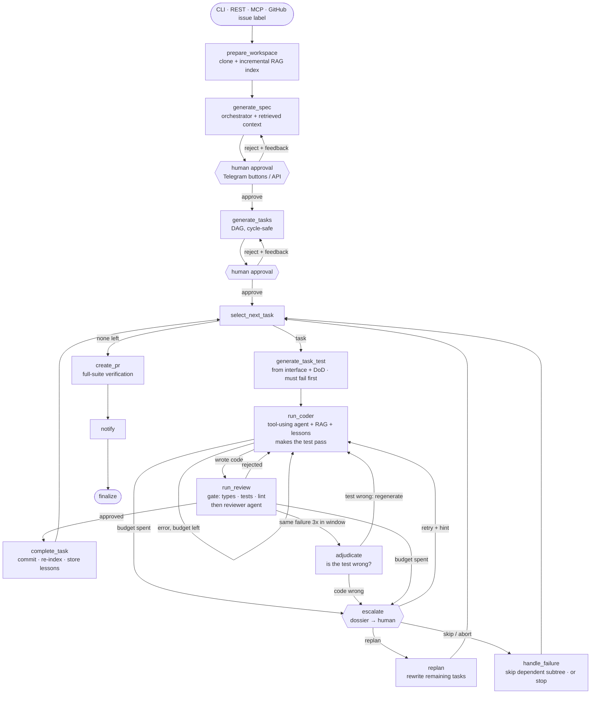

# agentflow

A multi-agent coding workflow built on **LangGraph**. You give it a feature request (CLI, REST, MCP, or a labelled GitHub issue). It writes a spec and a task plan and waits for a human to approve both. Then it implements each task test-first: an acceptance test is written from the task's interface and Definition of Done and must fail first, a coder agent makes it pass, a deterministic gate runs, and a reviewer agent checks the result. Finally it opens a pull request. Every agent uses **RAG over the target repository**: code-aware chunks, Voyage embeddings, and hybrid pgvector + full-text search.

It runs a whole workflow end to end: it calls tools, recovers from failures, pauses for people, and ships a PR. It is not a chat wrapper.



## How the vacancy requirements map to code

| Requirement | Where |
|---|---|
| **Python backend** | FastAPI (`api/app.py`), arq worker (`worker.py`), Pydantic everywhere, mypy-clean |
| **LLM APIs, agentic systems** | Anthropic (Opus/Sonnet) and DeepSeek via LangChain; `create_agent` coder and reviewer (`agents/`) |
| **LangGraph / LangChain** | 17-node `StateGraph` with typed reducers and runtime-context DI (`graph/`) |
| **Tool calling, structured outputs** | Coder tools (write/read/list/search) and Pydantic outputs for spec, plan, review and referee (`schemas.py`) |
| **RAG, embeddings, vector search** | `rag/`: language-aware chunking, incremental re-embedding by file hash, pgvector HNSW + Postgres FTS fused with RRF, token-budgeted context packing |
| **Context management** | Retrieval instead of whole-repo dumps; `pack_context` merges adjacent chunks under a token budget; agents can query more through tools |
| **State, memory** | Postgres checkpointer (per-run state, resumable), LangGraph Store with a semantic index (cross-run lessons, `memory/lessons.py`) |
| **Routing, retries, fallback** | Conditional edges (`graph/routing.py`); node `RetryPolicy` + timeouts; `.with_fallbacks()` on structured calls; `ModelFallbackMiddleware`, `ModelRetryMiddleware` and `ModelCallLimitMiddleware` on agents |
| **Recovery from failure** | Separate budgets, windowed stall detection (catches A↔B oscillation), a referee that can rewrite an unsatisfiable test, then escalation: a human picks retry-with-hint, re-plan, skip or abort |
| **API integrations, event-driven** | GitHub webhook (issue labelled → run → PR that closes it), Telegram inline buttons resume paused runs, Redis job queue |
| **Human-in-the-loop** | `interrupt()` at spec, plan, and whenever a task exhausts its budget (with an evidence dossier); answered via Telegram, REST, MCP or CLI; resumes deduplicated by checkpoint id |
| **MCP** | `mcp_server.py`: `start_run`, `get_run`, `review_checkpoint`, `search_codebase` |
| **Evaluation** | `evals/`: retrieval ablation (CI-gated), spec LLM-as-judge, e2e agent runs; all logged to LangSmith |
| **Tracing, monitoring** | LangSmith traces tagged by role and task; Prometheus metrics (`/metrics`, worker `:9100`); JSON logs |
| **Docker, K8s, CI/CD, AWS** | Multi-stage Dockerfile; Helm chart (HPA, PDB, ExternalSecrets, ServiceMonitor, IRSA); Terraform (VPC, EKS, RDS Postgres 17 + pgvector, ElastiCache, ECR, GitHub OIDC); GitHub Actions CI and CD |

## Quickstart

```bash
cp .env.example .env            # ANTHROPIC_API_KEY, DEEPSEEK_API_KEY, VOYAGE_API_KEY at minimum
uv sync

# See what the agents would retrieve (works offline, no keys needed)
uv run agentflow search tests/fixtures/sample_repo "where are passwords hashed"

# Full run in-process on a local repo: approve spec and plan in the terminal, commits land locally
uv run agentflow run "Add a change_email service that rejects duplicates" --path ../some-python-repo
```

### As a service

```bash
docker compose up -d            # postgres+pgvector, redis, api, worker
curl -X POST localhost:8010/runs -H 'content-type: application/json' \
     -d '{"prompt": "Add order history endpoint", "repo": "you/your-repo"}'
curl localhost:8010/runs/<thread_id>                       # status, spec, tasks, pending approval
curl -X POST localhost:8010/runs/<thread_id>/approval \
     -H 'content-type: application/json' -d '{"approved": true}'
```

You can also wire up these triggers:

- **GitHub webhook** → `POST /webhooks/github` (event: issues). Labelling an issue `agentflow` starts a run; the PR body says `Closes #N`.
- **Telegram webhook** → `POST /webhooks/telegram`. The worker posts the spec or plan with ✅/❌ buttons, and `/reject <thread> <feedback>` rejects with feedback. When a task runs out of budget, it posts the dossier with 🔁 Retry / 🗺 Re-plan / ⏭ Skip / 🛑 Stop buttons; `/hint <thread> <guidance>` retries with guidance.
- **Failed task via REST** → `POST /runs/<thread_id>/decision` with `{"action": "retry" | "replan" | "skip" | "abort", "hint": "..."}`.
- **MCP**: `uv run agentflow-mcp` (stdio) or `--http`. Add it to Claude Desktop or Claude Code to start and approve runs from chat.

## Design notes

**Hybrid retrieval.** Dense vectors find code by meaning ("where are users persisted"). Lexical search finds exact identifiers (`resolve_in_workspace`), which embeddings blur. Reciprocal Rank Fusion merges the two rankings without calibrating their scores. Each chunk is embedded with a `File: path (lines a-b)` header, so file names count too. The index is incremental and rebuilt after every completed task, so later tasks can retrieve code that earlier tasks wrote.

**One Postgres, three roles.** It holds LangGraph checkpoints (resumable runs), the LangGraph Store (semantic long-term memory), and the `code_chunks` vector + FTS table.

**Failure handling is the product.** This is a port of a TypeScript version that ran on real repos. Every rule in `graph/nodes.py` and `gate/` has a comment naming the failure it prevents. Some examples:

- The gate owns its own vitest config, because the coder kept narrowing `include` until no tests ran.
- A malformed reviewer response does not count against the task.
- A test that contradicts its own task is detected and rewritten instead of burning the whole budget.

**Contract-first TDD.** Every task in the plan carries a binding `interface`: module path, signatures, exceptions. Its acceptance test is written *before* the code, from that interface and the Definition of Done, and must fail first (red check). A test that already passes asserts nothing, so it is regenerated once. The coder then sees an executable target from its first attempt.

The original TypeScript version wrote tests first too, but without a fixed interface the test generator invented names (`addNote` where the spec said `add`) and deadlocked the coder. That led to a test-after mode, where the generator sees the code first. Test-after avoids the deadlock but biases tests toward whatever the code already does. Fixing names in the plan removes the deadlock without giving up independent tests, so test-after was removed. The referee still catches a test that contradicts its task.

**Escalation, not silent skipping.** When a task runs out of budget, the run pauses with an `interrupt()`. Previously it marked the task failed and quietly skipped everything that depended on it. Now a human gets a dossier:

- the attempts per budget;
- the distinct recent failures;
- the open reviewer requests;
- the files written so far;
- what would be blocked;
- the branch holding the partial work.

The human then chooses one of four actions:

- **retry**: budgets reset, and the hint goes into the coder's prompt as top-priority guidance;
- **re-plan**: a replanner rewrites only the not-yet-done tasks around the failure and gives them fresh ids, so no per-task state leaks in; completed work is untouched;
- **skip**: the old behaviour; the task's dependents are skipped too;
- **abort**: the run stops.

Unattended runs keep the old behaviour with `on_task_failure="skip"`. Each task can escalate at most `max_escalations_per_task` times, and a run can re-plan at most `max_replans` times.

This follows how production harnesses treat budget exhaustion: stop and escalate with the evidence, rather than "try harder" or drop work silently. Stall detection counts a failure's repeats over a window rather than only back-to-back, the way OpenHands' stuck detector also catches alternating patterns. The first live test-first run failed exactly that way: the test failed, the reviewer rejected the fix, and the cycle repeated.

**Gate per language.** `gate/` detects the target repo's language: Python gets pytest + ruff + mypy (or compileall); TypeScript gets tsc + vitest + eslint. Each gate reports the reason a check failed, not just the test name. It also never fails on conditions the coder can't fix, such as a scaffolding task with no sources yet.

## Evals

```bash
uv run python -m evals.retrieval_eval [--langsmith]   # recall@5 / MRR: dense vs lexical vs hybrid
uv run python -m evals.spec_eval                      # LLM-as-judge: testable / grounded / scoped
uv run python -m evals.e2e_eval                       # real models on the fixture repo: completion rate, gate/review cycles
```

Retrieval eval, offline (hash embeddings, so dense is noise; 20 queries over `src/`):

| mode | recall@5 | MRR |
|---|---|---|
| dense | 0.125 | 0.128 |
| lexical | 1.000 | 1.000 |
| hybrid | 0.775 | 0.568 |

Without real embeddings the dense half is hash noise, and fusing it in *lowers* hybrid below lexical-only. That is why the CI gate checks the lexical half offline and switches to hybrid once `VOYAGE_API_KEY` is set. Gating hybrid on noise made the check move with every unrelated code change.

Caveat: the golden queries were written by someone who knows the code, so they share vocabulary with it. That flatters lexical search. The next step is to replace them with queries the agents actually issued, taken from LangSmith traces, and to rerun with `VOYAGE_API_KEY` set to measure dense and hybrid properly.

## Interactive guide

`guide/` is a small React app that explains the project. It replays a real run step by step, gives each concept something to try (RAG search playground, routing simulator, HITL), lists the use cases, and tells the stories of the bugs found live. Start it with `cd guide && pnpm install && pnpm dev`.

## Live run

`scripts/live_smoke.py` drives the dockerised service end to end: `POST /runs` → approve spec → approve plan → wait.
A run on a private sandbox repo (Opus via an OpenAI-compatible proxy for orchestrator/tests/review, DeepSeek as coder)
planned two dependent tasks, passed the gate and review on the first attempt for both, and opened a PR with both
acceptance tests committed — 160 s wall time.

Getting there surfaced seven bugs the offline suite could not see, each now covered by a test:
- the workspace volume was root-owned
- linting the whole repo failed tasks on files the coder may not edit
- uncapped reviewer malfunctions looped forever when the API balance ran out
- DeepSeek's `thinking` flag must travel in `extra_body`
- a tool `name` kwarg broke the whole OpenAI-compatible fallback branch
- `ChatAnthropic` ignored keys from `.env`
- crashed runs had no terminal status

`pytest -m live` now makes one structured call per configured model *in isolation*, because a fallback chain
hides a broken fallback until the day the primary goes down.

Claude can be reached directly (`claude-*` model names, `ANTHROPIC_API_KEY`) or through an OpenAI-compatible proxy
(`cpx*` names, `CLAUDE_PROXY_URL` / `CLAUDE_PROXY_KEY`).

## Development

```bash
uv run pytest                        # 29 tests: gate, RAG, routing, API/webhooks, whole-graph e2e (LLMs faked)
docker compose up -d postgres && uv run pytest -m integration   # pgvector round-trip
uv run pytest -m live                # one real structured call per configured model (costs money)
uv run ruff check . && uv run mypy src
```

The graph e2e tests use real git, a real Python gate and real RAG, with fake LLM agents. They cover:

- spec rejection and revision
- a gate failure fed back to the coder
- a stall that reaches the referee
- skipping the dependent subtree after a failure
- review feedback stored as a lesson

## Layout

```
src/agentflow/
  agents/        orchestrator · test_generator · coder · reviewer (+ referee)
  graph/         state · context (DI) · nodes · routing · build
  rag/           chunking · embeddings · indexer · store (pgvector/in-memory) · retriever · tools
  gate/          python · typescript · detection
  memory/        lessons (LangGraph Store)
  integrations/  workspace (git) · github · telegram
  api/ worker.py mcp_server.py cli.py runner.py observability.py
evals/  tests/  docker/  deploy/helm/  infra/terraform/  .github/workflows/
```
